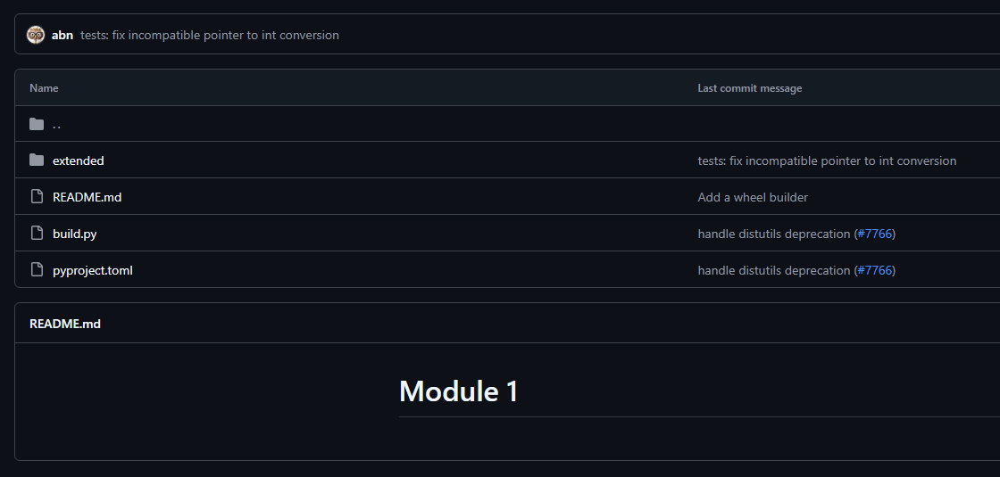

# Static code analysis

## 1. Project

**Project Name:**  
Poetry

**Description:**  
Poetry is a Python dependency manager. It aims to relieve users of the sometimes confusing process of setting up python programs, which often require multiple setup files. Poetry only requries input from one toml format file to handle all dependencies, allowing the user to swiftly start using a program.

**Repository URL:**  
https://github.com/python-poetry/poetry

**Intended Use Case:**  
Poetry is useful for people who need to manage, develop and use many different projects. Conventional use of a requirements.txt file becomes overly disorderly and outdated when working on multiple projects requiring many dependinces, often of varying versions between projects.

Poetry can be installed through pipx with the following command:

```bash
python -m pipx install poetry
```

Poetry also has a dedicaed installer which can be acquired from the releases github page.

To start a new project, simply run

```bash
poetry new [project-name]
```

This command creates a toml file, which is the important file that houses all dependencies that are required by the project.

---

## 2. GitHub Repository Overview

- Stars: 33.2k 
- Forks:  2.3k
- Watchers:  190
- Open Issues:  496
- Closed Issues:  5,680
- Open Pull Requests:  54
- Merged Pull Requests:  2,304
- Last Main Branch Commit / Activity: 04-05-2025  
- Contributors: 592
- License:  MIT

---

## 3. High-Level Architecture Overview

**Code Organization:**  
The repository houses standalone files next to subdirecories for more specific files, as seen in the following tree

```
Poetry
├── .github/
├── assets/
├── docs/
├── src/
│   └── poetry/
├── tests/
├── .cirrus.yml
├── .gitattributes
├── .gitignore
├── .pre-commit-config.yaml
├── .pre-commit-hooks.yaml
├── CHANGELOG.md
├── CITATION.cff
├── CODE_OF_CONDUCT.md
├── LICENSE
├── README.md
├── poetry.lock
└── pyproject.toml
```

The first level contains the files expected of an actively maintained project, such as a readme, license, code of conduct, citation file. In addition, all of the git files and directories are also present: gitignore, gitattributes and a github subdirectory.

Furthermore, files regarding program documentation and guidance are also present. Specifically, the assests directory contains a gif used in the readme. The docs subdirectory is well maintained and contains all documentation for the program.

Finally, there is there source code and test files. All the source code is contained within the src directory. First focusing on the test files for the program, which are located within the tests directory. The test files directory contains many scripts which are used to test new additions from pull requests. The architectural quality of these individual tests vary, however. For example, there is a testing project within poetry/tests/fixtures/bad_scripts_project/no_colon with an empty readme:


There are multiple test directories with a similar structure:



This is confusing when trying to deduce what individual tests do, as there is no documentation.

The source code itself will be examined within the quantitative overview, but the file structure seems to be orderly. Modules are put one level lower than the main poetry.py script, in respective subdirectories. The source directory also contains a __version__.py and __main__.py.

**Architectural Pattern:**
Poetry makes use of an object factory, which can be seen in the factory.py under src/. This file contains a factory class, which is used to create elements needed by the main Poetry program, such as an element for each of the required dependency of a project the Poetery user is working on.

**Dependencies:**  
Poetry requires at least Python 3.9. it can be used on LInux, macOS and windows systems. The only further requirement is a way to isntall poetry, which can be pipx or the poetry installer. You may also install poetry manually, but this is not advised. 

---

## 4. Quantitative Overview

- Lines of Code: 72,270 (Cloc)
- Number of Files / Modules:  595 (Cloc)
- Average Cyclomatic Complexity: 3.34 (Radon)
- Number of Functions / Methods:  3445 (Radon)
- Programming Languages Used:  
  - Python – 88.7%  
  - HTML – 11.3%

**Github Community Insight:**  
The project has been worked on by many contributors for more than six years. Because of poetry's popularity, there are 496 issues at the time of writing, which is not out of the ordinary for a project of this size. In general, the issues seem to be mostly related to installation, python and IDE version incompataiblities. Most active issues have multiple comments, indicating that there is still an active community working on the project. The same can be said for open pull requests.

---

## 5. Technical Analysis

**Tools Used:**  
Cloc: Lines of code and file counting
Radon: Cyclomatic Complexity and function/method count
flake8: PEP8 Compliance scoring

### Complexity Metrics
Radon indicates that the average cyclomatic complexity of the project
is 3.34, which indicates that modules are generally simple.

### Style and Codesmells
flake8 detected a couple of PEP8 guide violations.

```
8     E203 whitespace before ':'
2774  E501 line too long (88 > 79 characters)
2     E701 multiple statements on one line (colon)
3     F401 'keyring.backend' imported but unused
4     F811 redefinition of unused 'keyring' from line 15
```
The most common violation is line length. While it is undesirable, the maximum line length is only 9 characters longer than 79, the PEP8 suggestion. The notable violations are regarding F401 and F811. This indicates that there are unused imports, which somehow get redefined in a later module.

### Dead Code / Unused Imports
As reported earlier, there are 3 instances of an unused import.

### Security Issues
Using bandit to detect security issues for poetry code results in this:

```
Code scanned:
	Total lines of code: 54445
	Total lines skipped (#nosec): 0
	Total potential issues skipped due to specifically being disabled (e.g., #nosec BXXX): 0

Run metrics:
	Total issues (by severity):
		Undefined: 0
		Low: 2947
		Medium: 1
		High: 5
	Total issues (by confidence):
		Undefined: 0
		Low: 0
		Medium: 15
		High: 2938
Files skipped (0):
```

Most issues are low risk, but there are 6 notable issues of medium or high level.

```
>> Issue: [B306:blacklist] Use of insecure and deprecated function (mktemp).
   Severity: Medium   Confidence: High
   CWE: CWE-377 (https://cwe.mitre.org/data/definitions/377.html)
   More Info: https://bandit.readthedocs.io/en/1.8.3/blacklists/blacklist_calls.html#b306-mktemp-q
   Location: ./poetry/tests/installation/test_executor.py:150:19
149	    def _copy_wheel() -> Path:
150	        tmp_name = tempfile.mktemp()
151	        (tmp_path / tmp_name).mkdir()

>> Issue: [B324:hashlib] Use of weak MD5 hash for security. Consider usedforsecurity=False
   Severity: High   Confidence: High
   CWE: CWE-327 (https://cwe.mitre.org/data/definitions/327.html)
   More Info: https://bandit.readthedocs.io/en/1.8.3/plugins/b324_hashlib.html
   Location: ./poetry/src/poetry/publishing/hash_manager.py:28:31
27	            # FIPS mode disables MD5
28	            self._md5_hasher = hashlib.md5()
29	

>> Issue: [B202:tarfile_unsafe_members] tarfile.extractall used without any validation. Please check and discard dangerous members.
   Severity: High   Confidence: High
   CWE: CWE-22 (https://cwe.mitre.org/data/definitions/22.html)
   More Info: https://bandit.readthedocs.io/en/1.8.3/plugins/b202_tarfile_unsafe_members.html
   Location: ./poetry/src/poetry/utils/helpers.py:414:12
413	        with zipfile.ZipFile(source) as archive:
414	            archive.extractall(dest)
415	    else:

>> Issue: [B202:tarfile_unsafe_members] tarfile.extractall used without any validation. Please check and discard dangerous members.
   Severity: High   Confidence: High
   CWE: CWE-22 (https://cwe.mitre.org/data/definitions/22.html)
   More Info: https://bandit.readthedocs.io/en/1.8.3/plugins/b202_tarfile_unsafe_members.html
   Location: ./poetry/src/poetry/utils/helpers.py:426:16
425	            else:
426	   

>> Issue: [B324:hashlib] Use of weak SHA1 hash for security. Consider usedforsecurity=False
   Severity: High   Confidence: High
   CWE: CWE-327 (https://cwe.mitre.org/data/definitions/327.html)
   More Info: https://bandit.readthedocs.io/en/1.8.3/plugins/b324_hashlib.html
   Location: ./poetry/tests/integration/test_utils_vcs_git.py:177:15
176	def test_git_clone_fails_for_non_existent_revision(source_url: str) -> None:
177	    revision = sha1(uuid.uuid4().bytes).hexdigest()
178	

>> Issue: [B324:hashlib] Use of weak MD5 hash for security. Consider usedforsecurity=False
   Severity: High   Confidence: High
   CWE: CWE-327 (https://cwe.mitre.org/data/definitions/327.html)
   More Info: https://bandit.readthedocs.io/en/1.8.3/plugins/b324_hashlib.html
   Location: ./poetry/tests/repositories/fixtures/pypi.org/generate.py:107:19
106	        self.sha256 = hashlib.sha256(data).hexdigest()
107	        self.md5 = hashlib.md5(data).hexdigest()
108	
```

The medium risk problem is because the mktemp() function has been deprecated by mkstemp() for the bulit in python tempfile module. This problem occurs in a test file however, which could mean that this specific function is not part of the standard poetry program.

Two of the five high risk problems pertain to the use of a weak MD5 hash. As indicated by bandit, it may be better to include "usedforsecurity=False" when calling the MD5 hash function.

There are also two instances of tarfile.extractall being used without any validation. Members can be defined in the extractall function.

The last high risk problem is similar to the MD5 problem, except this problem describes a weak SHA1 hash. This can also be resolved by using "usedforsecurity=False". 

---

## 6. Reflection & Recommendations

**Overall Assessment:**  
In general, the project is well maintained but has some minor problems. Namely, the test directory is confusing because of the lack of complete documentation for the tests. The structure and contents of the other directories are clear. Lastly, The cyclomatic complexity is good on average.

**Refactoring Candidates:**  
The python code is written well with clear documentation. However, there are some PEP8 guideline violations. As discussed earlier, there are some lines which are slightly longer than the PEP8 suggested length. These lines can simply be split into two. The two imports of keyring may need to be examined, because they are unused. Further refactoring is not required.

**Recommendations to Developers:**  
The most important recommendation would be to take a look at the tests directory. Evaluating the relevance of each test would be beneficial. If a test is still releveant, writing a more concise readme for the test should adress the clarity problem. 

---

*Authored by: Orfeas Gkourlias*  
*Date: 15/05/2025*
